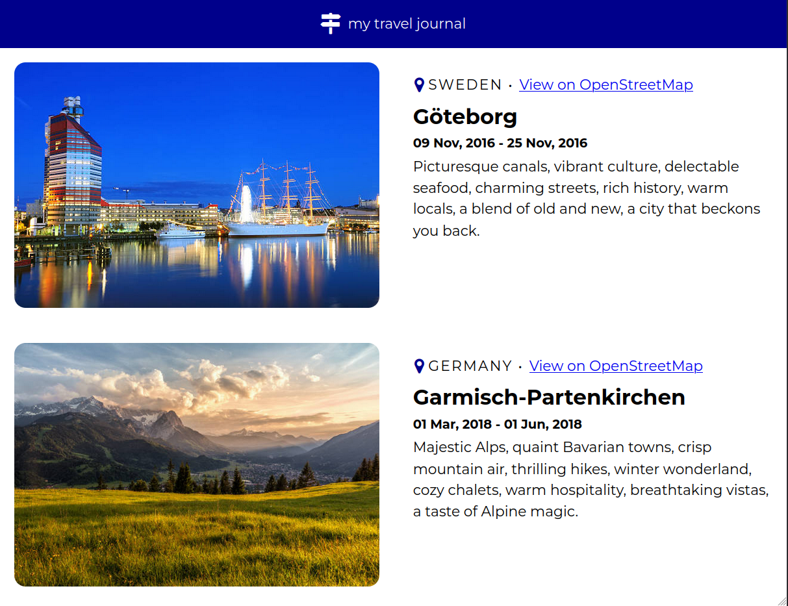
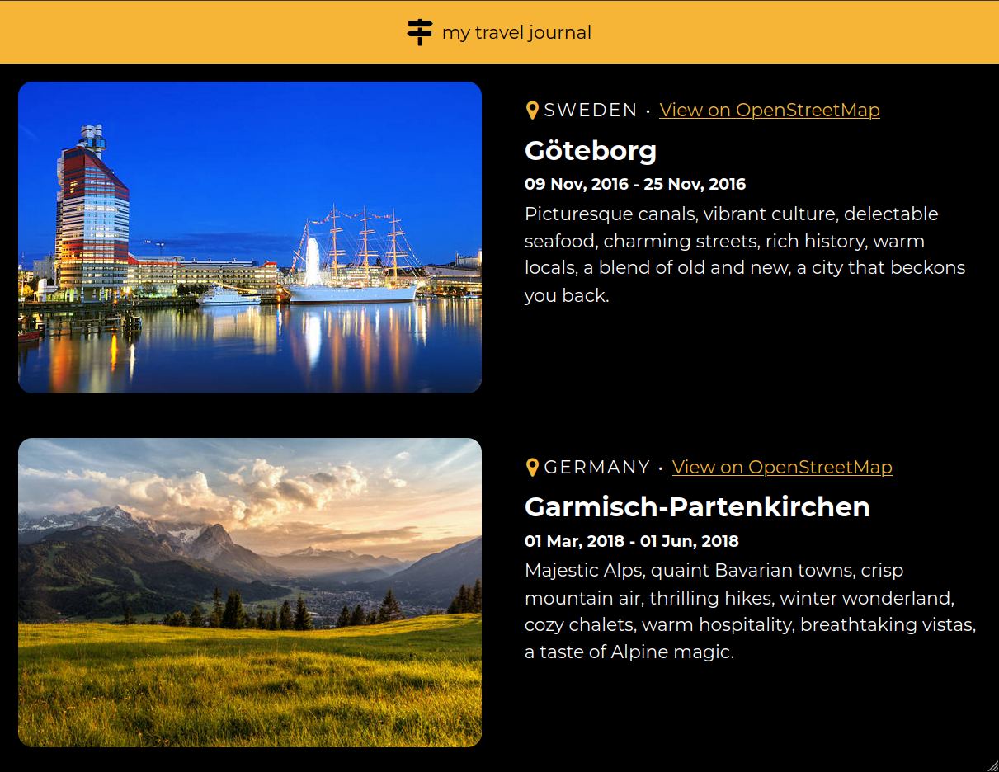

# Travel Journal 

Explore my travel journal, a React-based web app that chronicles my journeys
around the globe.

## Preview

## Running on your machine

To run this project locally, follow these steps:

1. Clone the repository
   (`git clone https://github.com/caiohenrique-3/travel-journal.git`)

2. Navigate to the project directory (`cd travel-journal`)

3. Install dependencies (`npm install`)

4. Start the development server (`npm run dev`)

The project will be accessible at http://127.0.0.1:8080.

## Acknowledgments

Special thanks to the following resources for their contributions to this
project:

- [Coolors](https://coolors.co/)
- [Fork Awesome](https://forkaweso.me/Fork-Awesome/)
- [Google Webfonts Helper](https://gwfh.mranftl.com/fonts)

## License

This project is licensed under the [MIT License](LICENSE).

---
